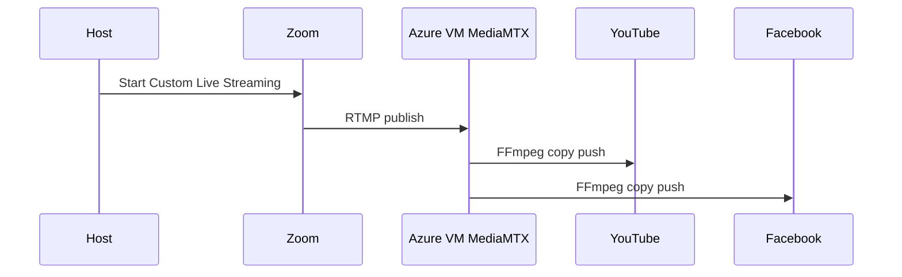

# MultiStreamCustom

Zoom Meeting → Azure RTMP relay → YouTube + Facebook at the same time.

## What you get



- Always-on `Standard_B2s` VM in **Central India**
- MediaMTX ingest + FFmpeg **stream copy** (no re-encode)
- Destination keys in **Azure Key Vault**
- PIN UI on the same VM (`http://<public-ip>/`)

## Cost reality

Always available ⇒ you pay for the VM while it runs (idle included). Roughly well under ₹9,000/month for 1 hour/day of dual HD egress, but the VM charge is 24/7. There is no free “hot” RTMP endpoint.

## Prerequisites

- Azure CLI logged in (`az login`) with rights to create RG/VM/Key Vault
- Zoom **Pro** (Custom Live Streaming)
- SSH key (`~/.ssh/id_ed25519.pub` or set `SSH_PUBLIC_KEY`)
- YouTube Live + Facebook Live stream keys when you go live

## 1) Deploy Azure

```bash
cd "/Users/sandipkumar.yadav/Desktop/MultiStreamCustom "
export UI_PIN='123456'          # change this
export RG=rg-multistream
export LOCATION=centralindia
bash infra/deploy.sh
```

Note the printed **Public IP** and **Key Vault** name.

## 2) Install on the VM

```bash
PIP=<public-ip-from-deploy>
KV=<key-vault-name-from-deploy>

scp -r . multistream@${PIP}:~/MultiStreamCustom
ssh multistream@${PIP}
cd ~/MultiStreamCustom
sudo bash vm/install.sh --key-vault "$KV" --location centralindia
```

Open `http://<public-ip>/`, unlock with `UI_PIN`, paste YouTube + Facebook keys.

## 3) Zoom

1. Start/join the meeting as host  
2. **More** → **Live on Custom Live Streaming Service**  
3. Paste from the UI:
   - **Stream URL:** `rtmp://<public-ip>/live`
   - **Stream key:** (shown in UI / Key Vault `ingest-stream-key`)
4. Start live streaming

Before Zoom: create/start the YouTube and Facebook live sessions so those keys are actually accepting video.

## Ops

| Item | Command |
|------|---------|
| Relay status | `sudo systemctl status mediamtx` |
| UI status | `sudo systemctl status multistream-ui` |
| Push logs | `sudo tail -f /var/log/multistream/*.log` |
| Resync keys | `sudo /opt/multistream/bin/sync-secrets.sh` |

## Security notes

- PIN is shared-team protection, not SSO. Restrict SSH (NSG source IP) when you can.
- UI is HTTP on port 80 by default. Add Let’s Encrypt later if you want HTTPS.
- Keep the ingest stream key private; anyone with URL+key can publish into your relay.

## Layout

```
infra/          Bicep + deploy.sh
vm/             MediaMTX, push scripts, install, systemd, nginx
ui/             Flask PIN UI
```
